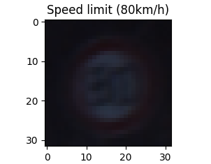
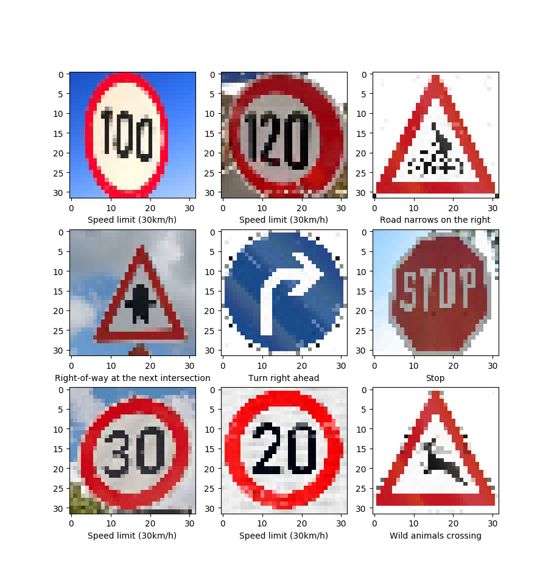

# Project: Build a Traffic Sign Recognition
The goals / steps of this project are the following
* Load the data set (see below for links to the project data set)
* Explore, summarize and visualize the dataa set
* Design, train and test a model architecture
* Use the model to make predictions on new images
* Analyze the softmax probabilities of the new images
* Summarize the results with a written report

# Data Set Summary & Exploration
1. The code for this step is in Traffic_Sign_Classifier.py from line 1 to 29
    I used pickle library to open binary files and python library to display the 
    statistic of traffic sign data set:
    * The size of the training set is 34799
    * The size of the test set is 12630
    * The shape of a traffic sign is (32, 32, 3)
    * The number of unique classes / labels in the data set is 43
2. The code for this step is in Traffic_Sign_Classifier.py from line 32 to 49
    I used pyplot to plot a random image in the data set. 
    Here is an example:



# Design and Test a Model Architecture
1. Preprocessing Data Set
    The code for this step is in Traffic_Sign_Classifier.py from line 51 to 55.
    I normalized the data to -1 and 1 by using numpy.

    ```python
    X_train = np.subtract(np.divide(X_train, 127), 1)
    ```
2. I seperated training, validation, and test set to avoid overfitting. 
    The validation set contains 4410 images and 12630 for test set.
3. My final model consisted of the following layers:

    Layer | Description
    ------|------------
    Input | 32x32x3 RGB images
    Conv 3x3 | strides: 1x1, padding: VALID, output: 28x28x6
    RELU |
    Max pooling | strides:2x2, output: 14x14x6
    Conv 3x3 | strides: 1x1, padding: VALID, output: 10x10x6
    RELU |
    Max pooling | strides:2x2, output: 5x5x16
    Flatten | output: 400
    Fully connected | output: 120
    RELU | 
    Dropout | probability: 0.5
    Fully connected | output: 84
    RELU |
    Dropout | probability: 0.5
    Fully connected | output: 43

4. The code for training the model is located in from line to 
    To train the model, I used:
    optimizer: AdamOptimizer
    batch size: 512
    number of epochs: 40
    mu = 0
    sigma = 0.1

5. The code for calculating the accuracy of the model is located in ....
    My final model results were:
    * training set accuracy of 97%
    * validation set accuracy of 94%
    * test set accuracy of 93%

# Test the Model on a New Set of Images
1. I downloaded 9 images from the web and I used pyplot to plot them as shown below:

    
2. Here are the results of the prediction:

    

    The model was able to correctly guess 8 out of 9 traffic signs, which gave an accuracy of 83%.
    This compares favorably to the accuracy on the test set of 43.

# Summary:
    It is a good starting point to use LeNet training model architecture for traffic sign recognition,
    but there are some more places to tune to get a better result. For example, I did not augmented the
    training data set. I am sure I can get a higher accuracy than 93% if I spent more time to augmented
    the training data set and fine tune the hyper-parameters. It surprised me that the model predict the
    20 km/h speed limit wrong. I am not really sure if the sign I got from the web is the German traffic
    sign for 20 km/h . 

 
